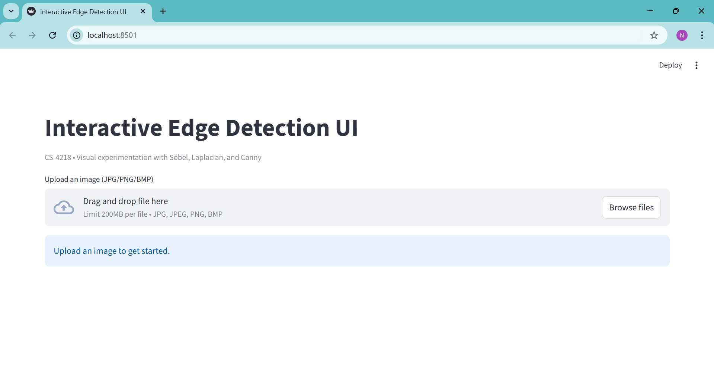
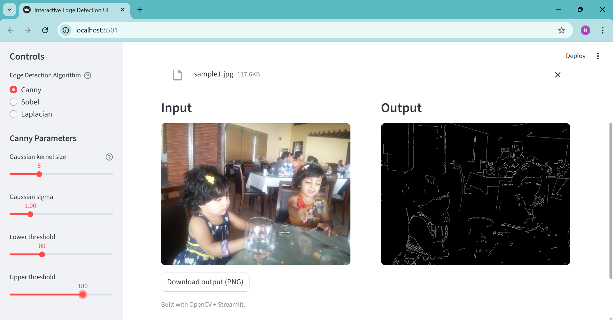
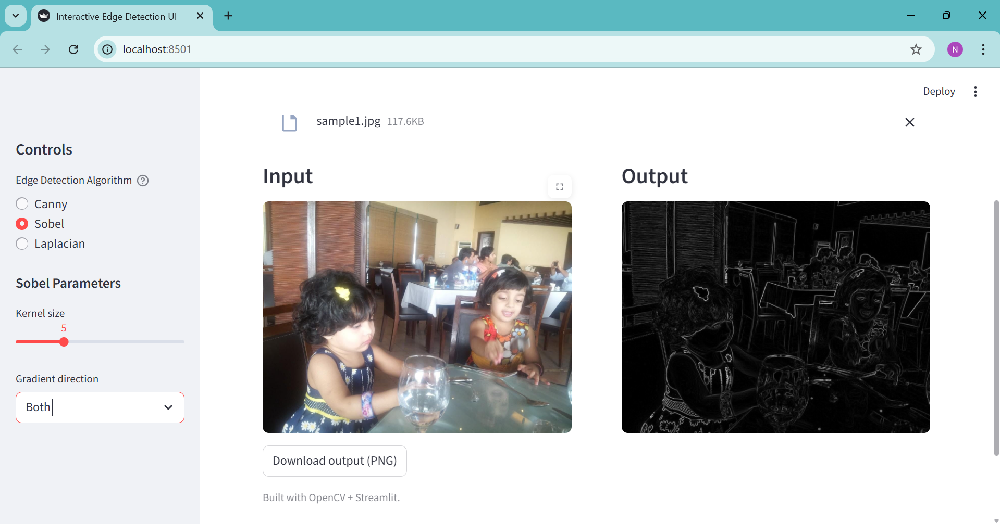
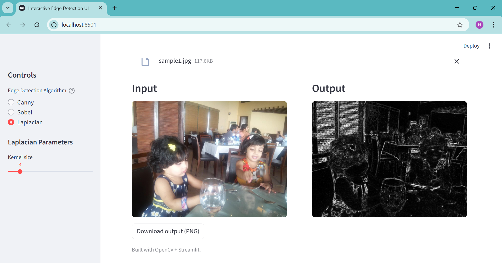

# Interactive Edge Detection UI (Streamlit + OpenCV)

An interactive edge detection tool built using **Streamlit** and **OpenCV**.  
Users can upload an image, select between **Canny**, **Sobel**, and **Laplacian** algorithms, and instantly view the detected edges with adjustable parameters all with live updates and a clean UI.

---

## Overview
This project provides an intuitive graphical interface for edge detection.  
It allows users to:
- Upload an image from their system  
- Choose an edge detection algorithm  
- Adjust parameters via sliders  
- View side-by-side comparison of input and output images  
- Download the processed result as a PNG file  

---

## Features
-  Upload any image (JPG, PNG, BMP)  
-  Select from three algorithms:
  - **Canny** – Gradient + Threshold-based edge detection  
  - **Sobel** – Directional derivative (X, Y, Both)  
  - **Laplacian** – Second-order derivative (omnidirectional)  
-  Adjustable parameters:
  - Kernel size  
  - Sigma (for Gaussian blur)  
  - Thresholds (for Canny)  
  - Real-time updates (auto recomputation on slider change)  
-  Download processed image as PNG  
-  Built modularly — processing and UI separated  

---

## Project Structure

```
EdgeDetectionUI/
│
├── app.py # Main Streamlit UI file
│
├── processors/
│ └── edges.py # Core edge detection algorithms
│
├── utils/
│ └── image_io.py # PIL ↔ OpenCV conversion helpers
│
├── screenshots/ # Example screenshots of the app
│ ├── main_ui.png
│ ├── canny_result.png
│ ├── sobel_result.png
│ └── laplacian_result.png
│
├── requirements.txt # Python dependencies
└── README.md # Project documentation
```


---

## Setup Instructions
To run this project locally:

1. **Clone the repository:**
   ```bash
   git clone https://github.com/yourusername/edge-detection-ui.git
   cd edge-detection-ui

2. **Install dependencies:**
    pip install -r requirements.txt

3. **Run the app:**
    streamlit run app.py

---

## Usage

Upload an image using the file uploader.
Select an edge detection algorithm: Canny, Sobel, or Laplacian.
Adjust the sliders for kernel size, sigma, and thresholds.
The app will instantly recompute and show output.
Download your result by clicking the Download Output (PNG) button.

---

## Screenshots

### Main Interface
This shows the layout of the app before uploading an image.


### Canny Edge Detection
Shows clear object edges detected with Canny.


### Sobel Edge Detection
Shows directional gradients in both X and Y axes.


### Laplacian Edge Detection
Shows omni-directional edges detected via Laplacian filter.


---

## Submitted by:
Name: Arooj Fatima
Roll no.:0058-BSCS-22


